# The latest revised Fast-Relaxed Vector Fitting for MATLAB

<p align="justify">
This repo contains an updated and optimized version of the Fast-Relaxed Vector Fitting algorithm, originally developed by Bjørn Gustavsen. The present implementation maintains the conceptual fidelity of the original method, widely used in electrical engineering and dynamic systems analysis, but introduces some improvements in terms of computational efficiency, code structure, and compatibility with modern versions of MATLAB. The main objective of this version is to facilitate its use in current modeling and simulation projects by providing cleaner, more modular, and faster code. This version can be especially useful for researchers and practitioners who require a reliable, efficient and updated tool for analysis in the Laplace or frequency domain.
</p>

<p align="justify">
<strong><i>IMPORTANT NOTE 1: Download the VECFITX package (last release) and run the examples in the "example_cases" folder for testing. The vecfitX function is located in the "functions" folder, along with additional functions used internally by vecfitX.</i></strong>
</p>

<p align="justify">
<strong><i>IMPORTANT NOTE 2: If the equations in this README are not displaying correctly, please use Google Chrome.</i></strong>
</p>

**Table of Contents**

- [1. Vector Fitting Theory](#vector-fitting-theory)
  - [1.1. Classical Vector Fitting](#classical-vector-fitting)
  - [1.2. Improvement in pole relocation](#improvement-in-pole-relocation-relaxed-condition-of-scaling-function)
  - [1.3. QR algorithm for efficient implementation](#qr-algorithm-for-efficient-implementation)
- [2. A comprehesive vecfitX tutorial](#a-comprehesive-vecfitx-tutorial)
  - [2.1. New features](#new-features)
  - [2.2. Settings](#settings)
  - [2.3. Function call](#function-call)
  - [2.4. Input and output data](#input-and-output-data)
    - [2.4.1. Description of the input data](#description-of-the-input-data)
    - [2.4.2. Description of the output data](#description-of-the-output-data)
  - [2.5. Iterative implementation](#iterative-implementation)
  - [2.6. Test cases](#test-cases)
- [3. Contact info](#contact-info)
- [4. References](#references)

## Vector Fitting Theory

### Classical Vector Fitting

<p align="justify">
One of the most utilized rational approximation techniques is Vector Fitting (VF). In 1999, VF was introduced and proved to be a highly robust and efficient rational approximation method, applicable to both smooth and resonant responses [1]. This caused VF to be rapidly adopted in several areas including power systems and macro-modeling systems. VF approximates a frequency response (generally an array) using a rational function approximation, as shown in <i>(1)</i>:
</p>


<p align="justify">
where <i>f(s)</i> may represent the transfer function or the frequency response of a system, <i>c</i><sub><i>n</i></sub> and <i>a</i><sub><i>n</i></sub> represent the sets of residues and poles, respectively; and both <i>d</i> and <i>e</i> are real coefficients. Since the solution of <i>(1)</i> is a nonlinear problem, VF resolves this issue by performing the approximation in two stages, represented by two separated linear problems, as described next.
</p>

<p align="justify">
In the first stage, a set of predetermined poles <i>â</i><sub><i>n</i></sub> distributed over the frequency range of interest is used. If <i>f(s)</i>  is a smooth function, real poles are employed; otherwise, complex poles are assumed, as in <i>(2)</i> :
</p>


<p align="justify">
Additionally, a frequency-dependent scaling function <i>σ(s)</i> is introduced with the same initial set of poles, as in <i>(4)</i>:
</p>


<p align="justify">
Considering the multiplication between <i>f(s)</i> and <i>σ(s)</i>, the following applies:
</p>


Substitution of <i>(4)</i> into <i>(5)</i> results in:


<p align="justify">
Since the initial set of poles is known, <i>(6)</i> represents a linear problem which can be solved via linear least squares approximation and provides the set of residues <i>ĉ</i><sub><i>n</i></sub>, which are used to obtain the zeros of <i>σ(s)</i> through the eigenvalues computation of <i>(7)</i>:
</p>


<p align="justify">
where <i>A</i> is a diagonal matrix containing the set of starting poles <i>â</i><sub><i>n</i></sub>, <i>b</i> is a column vector of ones, and <i>ĉ</i><sup><i>T</i></sup> is a row vector containing the set of residues <i>ĉ</i><sub><i>n</i></sub>. Subsequently, <i>(6)</i> can be represented as <i>(8)</i> which leads to <i>(9)</i>. Hence, the zeros of <i>σ(s)</i> are considered as the new poles of <i>f(s)</i>.
</p>


<p align="justify">
where <i>ẑ</i><sub><i>n</i></sub> are the zeros of <i>σ</i><sub><i>fit</i></sub><i>(s)</i>, and <i>z</i><sub><i>n</i></sub> are the zeros of <i>(σf)</i><sub><i>fit</i></sub><i>(s)</i>.
</p>

<p align="justify">
In the second stage, VF uses the new set of calculated poles and <i>(1)</i> is solved in the least squares sense to obtain an updated set of residues <i>ĉ</i><sub><i>n</i></sub>. The aforementioned process can be performed iteratively until the error between the measured function and fitted function is minimum. The diagram summarizing this procedure is shown below:
</p>

### Improvement in pole relocation: Relaxed condition of scaling function

<p align="justify">
VF operates by iteratively adjusting an initial set of poles to more optimal locations. When fitting the frequency-domain response of a rational function with the correct order, the poles can often be positioned accurately in a single step. However, when a lower-order function is used for the fit, multiple iterations may be required. The process becomes more challenging when the frequency response includes nonrational elements, such as noise, which can hinder convergence and, in some cases, even cause it to stall. A significant improvement in VF’s convergence properties can be achieved through a minor modification. As shown above, the classical formulation of VF incorporates a scaling function <i>σ(s)</i> that approaches unity at high frequencies. However, this high-frequency asymptotic condition can negatively impact convergence. To address this issue, the asymptotic condition is replaced with a more flexible constraint that ensures a nontrivial solution to the least-squares problem while avoiding the adverse effects on convergence [2]. Then equation <i>(4)</i> is replaced by <i>(10)</i>:
</p>


<p align="justify">
where <i>d̂</i> is real. In order to avoid the trivial solution. One equation is added to the resulting LS problem:
</p>


<p align="justify">
Equation <i>(11)</i> ensures that the sum of the real part of <i>σ(s)</i> over the given frequency samples is a nonzero value, while leaving all free variables unrestricted. Since <i>σ(s)</i> during iterations does not approach unity at high frequencies, <i>(7)</i> must be replaced with:
</p>


<p align="justify">
The zero calculation in <i>(12)</i> is only valid when <i>d̂</i> is nonzero. If the absolute value of <i>d̂</i> is found to be smaller than <i>tol = 1x10<sup>-8</sup></i>, the solution is discarded, and the least-squares problem has to be solved again with a fixed value for <i>d̂</i> in equation <i>(10)</i>.
</p>

### QR algorithm for efficient implementation

<p align="justify">
For multiport systems, the classical VF method requires solving large, sparse linear systems to estimate the rational function, as shown in equation (6). This becomes computationally expensive and memory-intensive as the number of ports grows. For example, a 60-port system with 101 frequency samples requires 54 GB of RAM in the standard implementation, making it impractical for typical workstations. Even if the structure under study has a moderate amount of ports, the size of the corresponding LS matrix may become prohibitively large. Furthermore, a lot of computational effort is wasted on the calculation of the residues <i>c</i><sub><i>n</i></sub>, which are discarded by the VF algorithm. In [3], the authors introduce a Fast VF method that leverages the QR decomposition to simplify the LS equations. This process leads to a simplified set of equations which depend only on <i>ĉ</i><sub><i>n</i></sub>. Instead of solving one large linear system for all ports, the method processes each matrix element (port) sequentially. For each element, the QR decomposition is applied to its corresponding linear system. This decomposes the problem into smaller, manageable parts. After decomposing all individual systems, the results are combined into a smaller, shared system.
</p>

<p align="justify">
As explained above, once the residues <i>ĉ</i><sub><i>n</i></sub> of <i>σ(s)</i> are computed, the common poles <i>â</i><sub><i>n</i></sub> of the transfer function are found by computing the eigenvalues of <i>(12)</i>. Note that the second stage of VF remains unchanged.
</p>

<p align="justify">
The modification of the VF with the two methods proposed in [2] and [3] have resulted in the third and last version of VF so far, better known as  <strong>Fast-Relaxed Vector Fitting (FRVF)</strong> [4]. This version is implemented in this repository under the name <strong><code>vectfitX</code></strong>.
</p>

## A comprehesive vecfitX tutorial

### New features

<p align="justify">
The vectfitX routine introduces several improvements over the original implementation (vecfit3), making it more versatile and efficient for practical applications. Key features include:
</p>

<ul>
    <li><strong>3D Data array support:</strong> The function now accepts a 3D array as input for the matrix <i>f(s)</i>. Unlike the original implementation, which required manual reshaping of the data into a 2D array (with frequency samples along the rows and matrix elements stacked in a single column), vectfitX automatically handles the input organization. Any 3D shape is accepted (e.g., rectangular, square, row or column vectors). </li>
    <li><strong>Efficient handling of symmetric matrices:</strong> Symmetric data matrices are processed by fitting only the lower triangular part, significantly reducing computational effort. This was not supported in the original version, where users had to apply symmetry considerations manually. </li>
    <li><strong>Cleaner and more readable code structure:</strong> The source code has been refactored to improve clarity, maintainability, and modularity. </li>
    <li><strong>Improved computational efficiency:</strong> Redundant operations have been removed, and key processes have been optimized through compact expressions and vectorization.</li>
    <li><strong>Future-proof MATLAB compatibility:</strong> The code has been reviewed and updated to ensure compatibility with current and upcoming MATLAB releases. </li>
    <li><strong>Direct output of pole-residue representation:</strong> Unlike the original version, vectfitX directly returns the pole-residue model, eliminating the need for additional functions to extract this representation. </li>
    <li><strong>Enhanced configuration options:</strong> Users can now customize output behavior more extensively. For example, generated plots can be automatically saved in common formats such as PDF, PNG, or JPEG. </li>
    <li><strong>Improved plot aesthetics:</strong> The appearance of plots has been refined for better readability and visual presentation. </li>
</ul>

### Settings

<p align="justify">
Like the original function written by Bjørn Gustavsen, vecfitX can be configured according to the user's requirements. Below is a list of the available options for customizing the function. You can set all the parameters or just some of them. Numbers in parentheses indicate the possible values ​​that a parameter can take.
</p>

<ul>
    <li>opt.relax:
        <ul>
            <li>(0) Use classical nontriviality constraint.</li>
            <li>(1) Use relaxed nontriviality constraint.</li>
        </ul>
    </li>
    <li>opt.stable:
        <ul>
            <li>(0) Unstable poles are kept unchanged.</li>
            <li>(1) Unstable poles are made stable by flipping them into the left half-plane.</li>
        </ul>
    </li>
    <li>opt.asymp:
        <ul>
            <li>(1) D and E are omitted in fitting process.</li>
            <li>(2) Only E is omitted in fitting process.</li>
            <li>(3) D and E are taken into account.</li>
        </ul>
    </li>
    <li>opt.skip_pole:
        <ul>
            <li>(1) The pole identification part is skipped. C, D and E are identified using the initial poles as final poles.</li>
        </ul>
    </li>
    <li>opt.skip_res:
        <ul>
            <li>(1) The residue identification part is skipped. Only the poles are identified.</li>
        </ul>
    </li>
    <li>opt.repre:
        <ul>
            <li>(0) The returned state-space model has real elements only. Output variable A is square with <i>2x2</i> submatrices as diagonal elements.</li>
            <li>(1) The returned state-space model has real and complex conjugate parameters. Output variable A is diagonal and sparse.</li>
            <li>(2) The returned model has a residue-pole representation. Output variable A (poles) is a <i>Nx1</i> vector, variable C (residues) is a <i>Nrx(NxNc)</i> array. Variables D and E are <i>NrxNc</i> arrays.</li>
        </ul>
    </li>
    <li>opt.errplot:
        <ul>
            <li>(1) Include deviation in magnitude and phase angle plots.</li>
        </ul>
    </li>
    <li>opt.fitplot:
        <ul>
            <li>(1) Create plots of fitted function compared to the original function. Both magnitude and phase angle are shown.</li>
        </ul>
    </li>
    <li>opt.sigmaplot:
        <ul>
            <li>(1) Create plot of sigma function.</li>
        </ul>
    </li>
    <li>opt.savefig:
        <ul>
            <li>(0) Figures are not saved.</li>
            <li>(1) Save plots in PDF format.</li>
            <li>(2) Save plots in PNG format.</li>
            <li>(3) Save plots in JPEG format.</li>
            <li>(4) Save plots in SVG format.</li>
        </ul>
    </li>
</ul>

<p align="justify">
If you omit the vecfitX.m configuration, the function has the following default parameters:
</p>

```matlab
def.relax = 1;                            % Use vector fitting with relaxed non-triviality constraint
def.stable = 1;                           % Enforce stable poles
def.asymp = 3;                            % Include both D and E  
def.skip_pole = 0;                        % Do not skip pole identification
def.skip_res = 0;                         % Do not skip identification of residues (C,D,E) 
def.repre = 1;                            % Create complex state space representation
def.errplot = 1;                          % Include deviation in magnitude and phase angle plot
def.fitplot = 1;                          % Create plots of fitted and original functions
def.sigmaplot = 0;                        % Exclude plot of sigma function
def.savefig = 0;                          % Figures are not saved
```

### Function call

<p align="justify">
    The following are some valid calls to the vecfitX function. The inputs and outputs are explained in detail below. It is important to note that vecfitX relies on several non-built-in functions. These functions, along with vecfitX, are included in the "source" folder. Please download the entire folder to ensure vecfitX functions properly. Test cases can be found in the "test_cases" folder. In some instances, external .txt files are required, and these are also included in the test cases folder.
</p>

```matlab
[SER,poles,rmserr,fit] = vectfitX(f,s,poles,weight,opt);
[SER,poles,rmserr,fit] = vectfitX(f,s,poles,weight);
[SER,poles,rmserr] = vectfitX(f,s,poles,weight);
```

### Input and output data

#### Description of the input data:

<ul>
    <li><strong><code>f</code>:</strong> Matrix <i>f(s)</i> function (3D array as shown in fig. 1.1) to be fitted with dimensions <i>Nr X Nc X Ns</i>. It is important to note that the elements of a layer (2D array) are listed by column (column-by-column order). vecfitX uses this order by default throughout the FRVF routine, even if a row vector is processed. In figure 1.1, <i>f(s)</i> is a non-symmetric matrix and is not limited to a square shape. In case <i>f(s)</i> is a symmetric matrix, vecfitX uses the lower triangular portion by default (as shown in Figure 1.2) to make fitting more efficient.
        <br><br>
        <table align="center">
          <tr>
            <td align="center">
             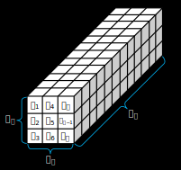<br>
             <em>Figure 1.1: f(s) representation as a 3D array (non-symmetric case).</em>
            </td>
            <td align="center">
              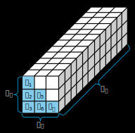<br>
              <em>Figure 1.2: f(s) representation as a 3D array (symmetric case).</em>
            </td>
          </tr>
        </table>
        <ul>
            <li><i>Nr</i>: Number of rows in array.</li>
            <li><i>Nc</i>: Number of columns in array.</li>
            <li><i>Ns</i>: Number of layers (frequency samples) in array.</li>
        </ul>
        <br><br>
    Although <i>f(s)</i> is a 3D array, a 2D matrix representation is required within the FRVF algorithm. Before executing the algorithm, at the start of the vecfitX function, the original 3D array is converted into a 2D matrix using a column-by-column order (as shown above). In this way, the rows of the new matrix correspond to the number of elements in a layer (in the original array), and the columns correspond to the frequency samples of each element (as shown in fig. 2.1). In the case of a symmetric array, the number of rows in the new matrix is ​​lower because only the lower triangular part is used (see fig. 2.2).
        <br><br>
        <table align="center">
          <tr>
            <td align="center">
             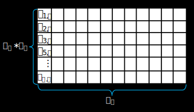<br>
             <em>Figure 2.1: f(s) representation as a 2D array (non-symmetric case).</em>
            </td>
            <td align="center">
              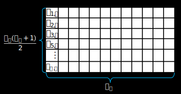<br>
              <em>Figure 2.2: f(s) representation as a 2D array (symmetric case).</em>
            </td>
          </tr>
        </table>
    </li>
    <br><br>
    <li><strong><code>s</code>:</strong> Vector of frequency samples [rad/sec] with dimensions <i>1 X Ns</i>.</li>
    <br><br>
    <li><strong><code>poles</code>:</strong> Vector of initial poles [rad/sec] with dimensions <i>1 X N</i>.  The selection of the initial poles can be done in different ways. Some examples of how to do this are shown in the test cases. Further details are given in [4].</li>
    <br><br>
    <li><strong><code>weight</code>:</strong> The elements in the system matrix are weighted using this array. It can be used for achieving higher accuracy at desired frequency samples. If no weighting is desired, use unitary weights, i.e. weight array of ones, with dimensions <i>1 X Ns</i>. Otherwise, 1D and 2D arrays are allowed.</li>
    <br><br>
        <table align="center">
          <tr>
            <td align="center">
             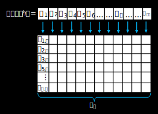<br>
             <em>Figure 3.1: Common weight array.</em>
            </td>
            <td align="center">
              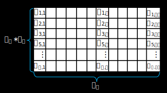<br>
              <em>Figure 3.2: Individual weight array.</em>
            </td>
          </tr>
        </table>
        <ul>
            <li><strong>1D array</strong>: Common weighting for all elements, weight array with dimensions <i>1 X Ns</i>. As shown in fig. 3.1, a multiplication is performed element-by-element between the weight array and each row of the reshaped <i>f(s)</i>.</li>
            <li><strong>2D array</strong>: Individual weighting, weight array with dimensions <i>(Nr*Nc) X Ns</i>. In this case, the weight array has the same dimension as the reshaped <i>f(s)</i>. Therefore, multiplication is done element by element between both arrays. If the original <i>f(s)</i> array is symmetric, the number of rows in weight array must have the same dimension as the matrix in fig 2.2. In both cases (symmetric and non-symmetric), before using any weighting strategy based on the elements of <i>f(s)</i>, it is necessary to use <code>stackM</code> to transform <i>f(s)</i> into a 2D matrix as already explained. Different weighting strategies are shown in test cases. Refer to [4] for more details.</li>
        </ul>
    <br><br>
    <li><strong><code>opt</code>:</strong> Configuration options.</li>
</ul>

#### Description of the output data:

<ul>
    <li><strong><code>SER.A</code>:</strong> Array containing the poles of the fitted matrix function.
        <ul>
            <li> If <strong><code>opt.repre = 0</code>:</strong> A is sparse, square and real with <i>2 X 2</i> submatrices as diagonal elements, with dimensions <i>N X N</i>.</li>
            <br><br>
        <table align="center">
          <tr>
            <td align="center">
             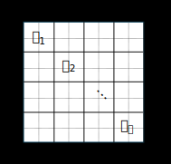<br>
             <em>Figure 4: Array A (<code>SER.A</code>) in the real state space model.</em>
            </td>
          </tr>
        </table>
    <br><br>
            <li> If <strong><code>opt.repre = 1</code>:</strong> A is sparse, diagonal and complex, with dimensions <i>N X N</i>.</li>
          <br><br>
        <table align="center">
          <tr>
            <td align="center">
             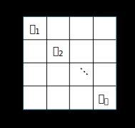<br>
             <em>Figure 5: Array A (<code>SER.A</code>) in the complex state space model.</em>
            </td>
          </tr>
        </table>
    <br><br>
            <li> If <strong><code>opt.repre = 2</code>:</strong> A is a complex vector with dimensions <i>N X 1</i>.</li>
          <br><br>
        <table align="center">
          <tr>
            <td align="center">
             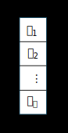<br>
             <em>Figure 6: Array A (<code>SER.A</code>) in the residue-pole model.</em>
            </td>
          </tr>
        </table>
    <br><br>
        </ul>
    </li>
    <li><strong><code>SER.B</code>:</strong> Nx1 matrix only for real and complex state space representation.
        <ul>
          <br><br>
        <table align="center">
          <tr>
            <td align="center">
             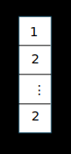<br>
             <em>Figure 7.1: Array B (<code>SER.B</code>) in the real state space model.</em>
            </td>
            <td align="center">
              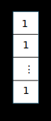<br>
              <em>Figure 7.2: Array B (<code>SER.B</code>) in the complex state space model.</em>
            </td>
          </tr>
        </table>
            <li> If <strong><code>opt.repre = 0</code>:</strong> B is a column vector of zeros, ones and twos (see fig. 7.1).</li>
            <li> If <strong><code>opt.repre = 1</code>:</strong> B is a column vector of ones (see fig. 7.2).</li>
        </ul>
    </li>
  <br><br>
    <li><strong><code>SER.C</code>:</strong> Array containing the residues of the fitted matrix function.
        <ul>
          <br><br>
        <table align="center">
          <tr>
            <td align="center">
             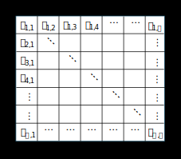<br>
             <em>Figure 8.1: Array C (<code>SER.C</code>) in the state space model (real or complex).</em>
            </td>
            <td align="center">
              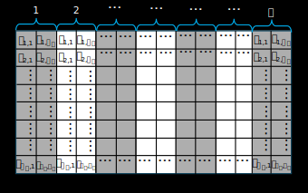<br>
              <em>Figure 8.2: Array C (<code>SER.C</code>) in the residue-pole model.</em>
            </td>
          </tr>
        </table>
            <li> If <strong><code>opt.repre = 0</code>:</strong> C is real with dimensions <i>(Nr*Nc) X N</i> (see fig. 8.1).</li>
            <li> If <strong><code>opt.repre = 1</code>:</strong> C is complex with dimensions <i>(Nr*Nc) X N</i> (see fig. 8.1).</li>
            <li> If <strong><code>opt.repre = 2</code>:</strong> C is complex with dimensions <i>Nr X (N*Nc)</i> (see fig. 8.2).</li>
        </ul>
    </li>
  <br><br>
    <li><strong><code>SER.D</code>:</strong> If the residue-pole model is selected, D is a real constant term of dimensions <i>Nr X Nc</i>. Otherwise, D is a column vector of dimensions <i>(Nr*Nc) X 1</i>. Note that in a symmetric matrix the dimension of D is smaller, since only the lower triangular part is fitted. </li>
  <br><br>
    <li><strong><code>SER.E</code>:</strong> If the residue-pole model is selected, E is a real proportional term of dimensions <i>Nr X Nc</i>. Otherwise, E is a column vector of dimensions <i>(Nr*Nc) X 1</i>. Note that in a symmetric matrix the dimension of E is smaller, since only the lower triangular part is fitted.</li>
  <br><br>
    <li><strong><code>ord_zrs</code>:</strong> <i>1 X N</i> matrix containing the newly calculated poles.</li>
  <br><br>
    <li><strong><code>rms</code>:</strong> root-mean-square error (scalar) of approximation for <i>f(s)</i>. 0 is returned if <code>skip_res = 1</code>.</li>
  <br><br>
    <li><strong><code>fit</code>:</strong> <i>(Nr*Nc) X Ns</i> array containing the rational approximation of <i>f(s)</i>. 0 is returned if <code>skip_res = 1</code>. If <i>f(s)</i> is a symmetric matrix, then fit has <i>(Nr*(Nr+1)/2)</i> rows and <i>Ns</i> columns. Note that <code>fit</code> has the same shape as the arrays in figures 2.1 and 2.2 (depending on the case). If you require a 3D representation of <code>fit</code>, just like the original <i>f(s)</i> function, use the <code>res2fit</code> function after calling vecfitX with the residue-pole representation, as shown below.</li>
</ul>

```matlab
opt.repre = 2;
[SER,poles] = vectfitX(fs,s,poles,weight,opt);
pl = 1; % If pl = 1, res2fit creates plots of fitted function compared to the original f(s). Both magnitude and phase angle are shown.
[fs_fit, rms] = res2fit(s, SER, fs, Nr, Nc, pl); % fs_fit is the fitted function with the same 3D representation as f(s).
```

### Iterative implementation

<p align="justify">
    A common practice is to iteratively apply the FRVF to improve the relocation of the calculated poles and achieve higher accuracy. This is achieved as follows:
</p>

```matlab
opt.skip_res = 1;          % Residue identification part is skipped.
opt.repre = 2;             % Pole-residue representation.
opt.fitplot = 1;           % Include graphs of fitted function.

Niter = 5;                 % Number of the iterations.
for iter = 1:Niter
  if iter == Niter
      opt.skip_res = 0;    % In the last iteration residue identification part is NOT skipped.
  end
    [SER,poles,rmserr,fit] = vectfitX(bigY,s,poles,weight,opt);
end
```
<p align="justify">
    It is important to note that residue identification is skipped until the last iteration. This is to reduce computation time. Keep in mind that residue identification should be performed with the last set of poles calculated. When residue identification is disabled, graph creation is also disabled. Even if it has been manually enabled, as in the previous example. This way, only the plots corresponding to the last iteration are displayed.
</p>

### Test cases

<p align="justify">
    In order to demonstrate the use of the vecfitX function, test cases have been included in this repository. The examples and data have been taken and adapted from [4]. A brief description of these cases is shown below:
</p>

<ul>
  <li><strong><code>ex1.m</code>:</strong> In this program, an artificial scalar function <i>f(s)</i> is constructed. <i>f(s)</i> is a row vector whose elements correspond to two predefined partial fractions. In addition, 18 complex starting poles are used, vecfitX is called three times iteratively (new poles are used as starting poles in each iteration), and a real state-space representation is selected. The plots obtained are shown below.
<br><br>
<table align="center">
  <tr>
    <td align="center">
      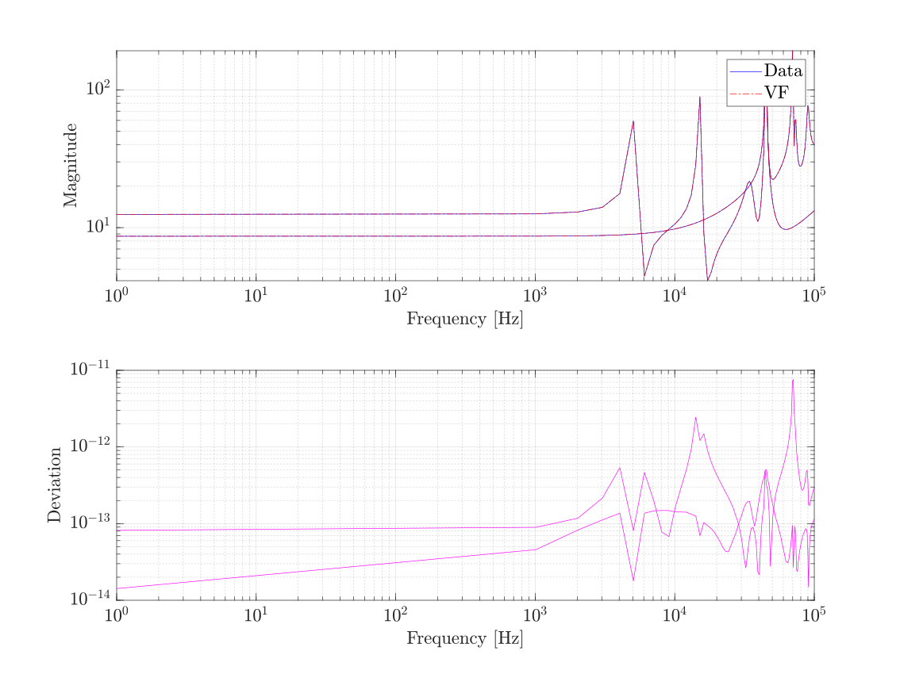<br>
      <em>Figure 9.1: Magnitude plot.</em>
    </td>
    <td align="center">
      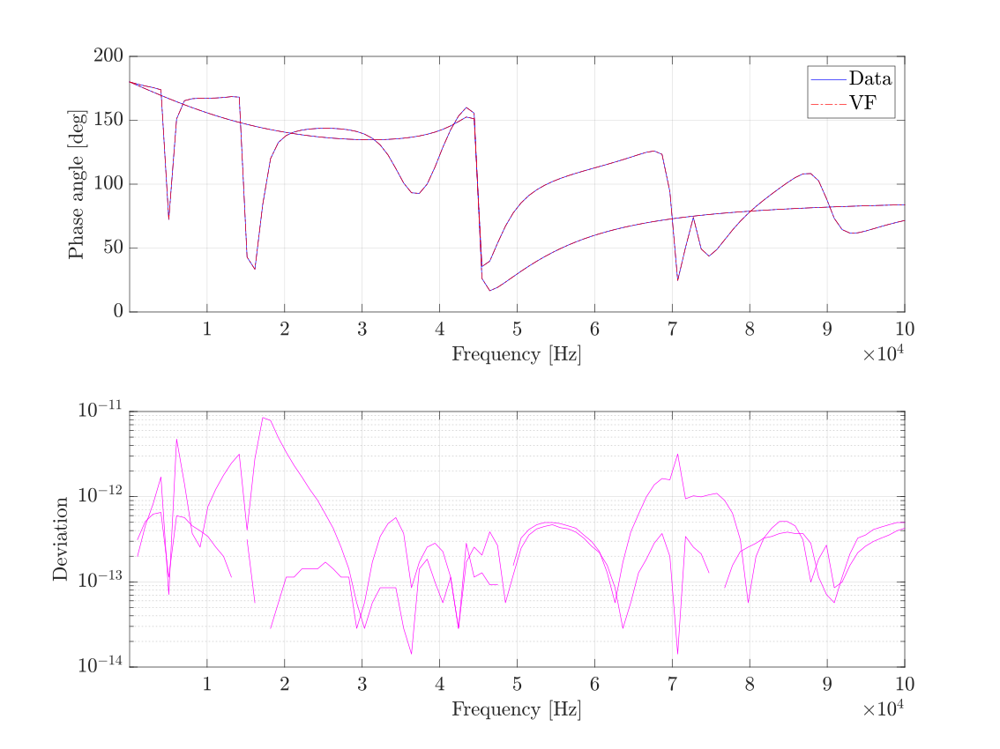<br>
      <em>Figure 9.2: Phase angle plot.</em>
    </td>
  </tr>
</table>
<br><br>
  </li>
    <li><strong><code>ex2.m</code>:</strong> In this example, the measured response of a transformer <i>f(s)</i> (scalar) is read from file <code>03pk10.txt</code>. In addition, 30 complex starting poles are used, vecfitX is called five times iteratively (new poles are used as starting poles in each iteration), a complex state-space representation is selected, and <i>f(s)</i> is weighted with the inverse of its magnitude. The plots obtained are shown below.
        <br><br>
<table align="center">
  <tr>
    <td align="center">
      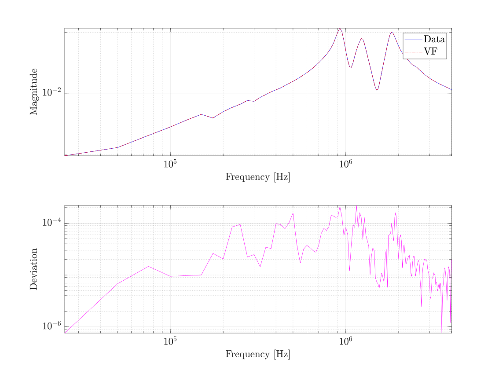<br>
      <em>Figure 10.1: Magnitude plot.</em>
    </td>
    <td align="center">
      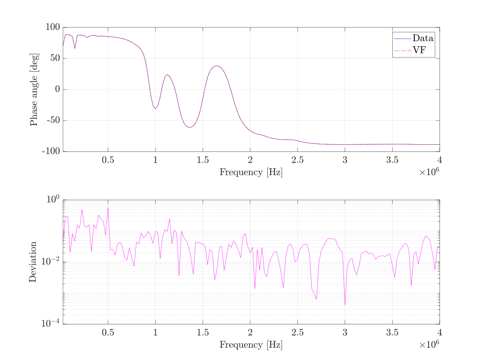<br>
      <em>Figure 10.2: Phase angle plot.</em>
    </td>
  </tr>
</table>
<br><br>
    </li>
    <li><strong><code>ex3.m</code>:</strong> In this program, a calculated terminal admittance <i>6 X 6 X 300</i> matrix <i>Y(s)</i> of a power system is read from file <code>fdne.txt</code>. Only the first column of <i>Y(s)</i> is fitted, as follows: 50 complex starting poles are used, vecfitX is called five times iteratively (new poles are used as starting poles in each iteration), a complex state-space representation is selected, and <i>Y(s)</i> is weighted with the inverse of the square root of its magnitude. The plots obtained are shown below.
        <br><br>
<table align="center">
  <tr>
    <td align="center">
      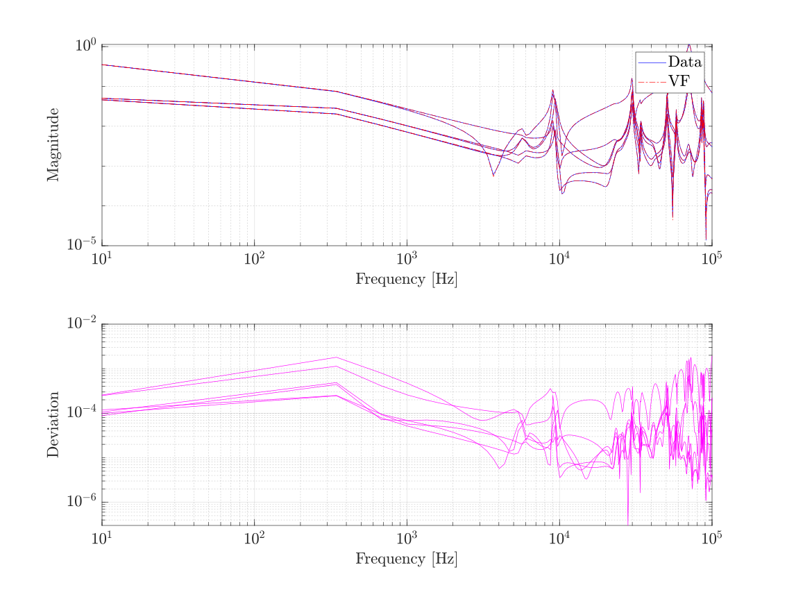<br>
      <em>Figure 11.1: Magnitude plot.</em>
    </td>
    <td align="center">
      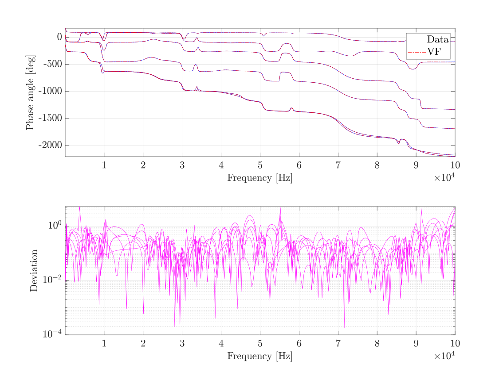<br>
      <em>Figure 11.2: Phase angle plot.</em>
    </td>
  </tr>
</table>
<br><br>
    </li>
    <li><strong><code>ex4.m</code>:</strong> In this example, the same <i>6 X 6 X 300</i> matrix <i>Y(s)</i> is used. Now a complete complex state-space representation is calculated by fitting <i>Y(s)</i> column by column (each column has a different set of poles). In addition, 50 complex starting poles are used and improved on by fitting the element sum of the first column before fitting all columns, vecfitX is called 3 times iteratively (for each column),  and the columns of <i>Y(s)</i> are weighted with the inverse of the square root of its magnitudes. The plots obtained of the last column are shown below.
        <br><br>
<table align="center">
  <tr>
    <td align="center">
      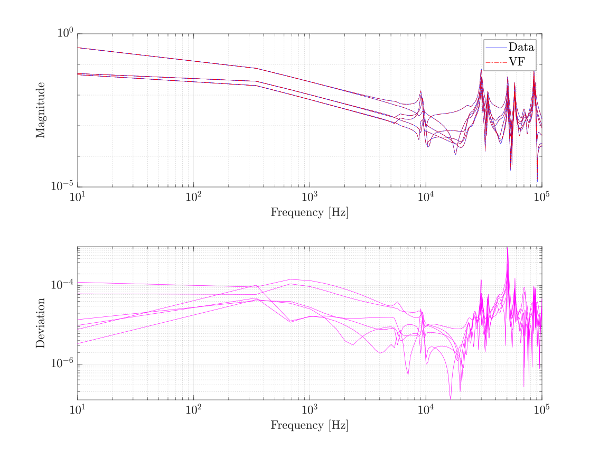<br>
      <em>Figure 12.1: Magnitude plot.</em>
    </td>
    <td align="center">
      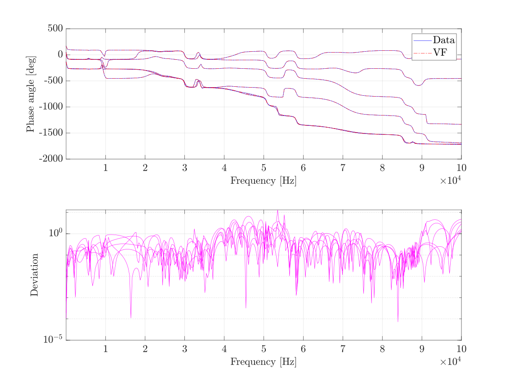<br>
      <em>Figure 12.2: Phase angle plot.</em>
    </td>
  </tr>
</table>
<br><br>
    </li>
    <li><strong><code>ex5.m</code>:</strong> Again the same <i>6 X 6 X 300</i> matrix <i>Y(s)</i> is used. Now a residue-pole representation is calculated by fitting <i>Y(s)</i> (all elements has a common set of poles). The fitting is performed similarly to the previous example. After obtaining the residue-pole representation, the <code>res2fit</code> function is used to obtain the fitted matrix in its original shape. The plots obtained are shown below.
        <br><br>
<table align="center">
  <tr>
    <td align="center">
      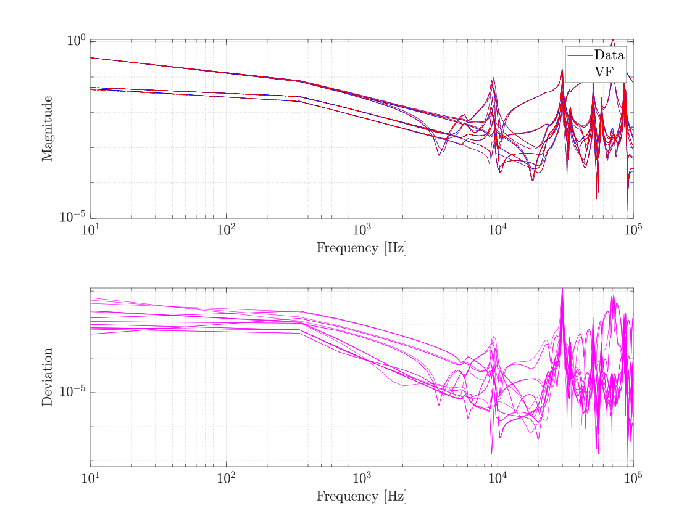<br>
      <em>Figure 13.1: Magnitude plot.</em>
    </td>
    <td align="center">
      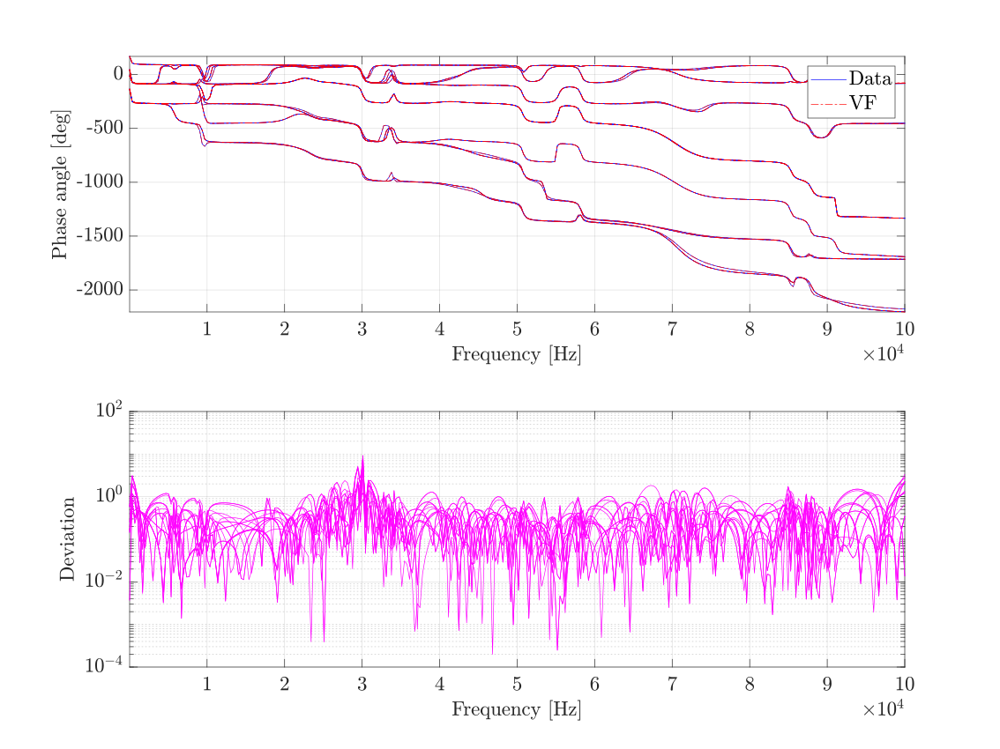<br>
      <em>Figure 13.2: Phase angle plot.</em>
    </td>
  </tr>
</table>
<br><br>
    </li>
</ul>

## Contact info
<p align="justify">
If you would like to get in touch for professional collaboration, research proposals, or questions related to my work, feel free to reach out through any of the following channels:
</p>
<ul>
  <li><strong>Primary email:</strong> josejamangape@gmail.com</li>
  <li><strong>Secondary email:</strong> esteban.enriquez@cinvestav.com</li>
  <li><strong>LinkedIn:</strong> <a href="https://www.linkedin.com/in/jose-esteban-enriquez-jamangape-9a024131a/">Jose Esteban Enriquez</a></li>
  <li><strong>GitHub:</strong> <a href="https://github.com/EstebanEnriquez">Esteban Enriquez</a></li>
  <li><strong>ResearchGate:</strong> <a href="https://www.researchgate.net/profile/J-Enriquez-Jamangape?ev=hdr_xprf">J. E. Enríquez-Jamangape</a></li>
</ul>

## References
<p align="justify">
[1]  B. Gustavsen and A. Semlyen, "Rational approximation of frequency domain responses by Vector Fitting", IEEE Trans. Power Delivery, vol. 14, no. 3, pp. 1052-1061, July 1999.

[2] B. Gustavsen, "Improving the pole relocating properties of vector fitting", IEEE Trans. Power Delivery, vol. 21, no. 3, pp. 1587-1592, July 2006.

[3] D. Deschrijver, M. Mrozowski, T. Dhaene, and D. De Zutter, “Macromodeling of Multiport Systems Using a Fast Implementation of the Vector Fitting Method”, IEEE Microwave and Wireless Components Letters, vol. 18, no. 6, pp. 383-385, June 2008.

[4] B. Gustavsen, "User's Guide for vectfit3.m (Fast, Relaxed Vector fitting)", SINTEF Energy Research, N-7465 Trondheim, Norway, 2008. Aviable online: <a href="https://www.sintef.no/en/software/vector-fitting/downloads/#menu">vecfit3.m for MATLAB</a>.
</p>

